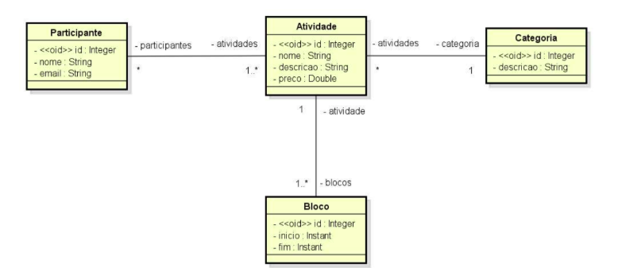

# Projeto de Gerenciamento de Atividades

Este projeto implementa um sistema de gerenciamento de atividades, utilizando Hibernate como ORM para manipulação de entidades e persistência de dados em um banco relacional. O domínio do sistema é composto pelas entidades `Activity`, `Attendant`, `Block`, e `Category`.

## Estrutura do Projeto

### Entidades

#### **Activity**

- Representa uma atividade oferecida no sistema.
- Campos:
    - `id` (Long): Identificador único da atividade.
    - `name` (String): Nome da atividade.
    - `description` (String): Descrição da atividade.
    - `price` (Double): Preço da atividade.
    - `category` (Category): Categoria da atividade (relacionamento `@ManyToOne`).
    - `attendants` (List): Lista de atendentes vinculados à atividade (relacionamento `@ManyToMany`).
    - `blocks` (List): Blocos de horário associados à atividade (relacionamento `@OneToMany`).

#### **Attendant**

- Representa um atendente associado a uma ou mais atividades.
- Campos:
    - `id` (Long): Identificador único do atendente.
    - `name` (String): Nome do atendente.
    - `email` (String): E-mail único do atendente.
    - `activities` (List): Lista de atividades em que o atendente está associado (relacionamento `@ManyToMany`).

#### **Block**

- Representa um intervalo de horário em que uma atividade ocorre.
- Campos:
    - `id` (Long): Identificador único do bloco.
    - `start` (Instant): Horário de início do bloco.
    - `end` (Instant): Horário de término do bloco.
    - `activity` (Activity): Atividade associada ao bloco (relacionamento `@ManyToOne`).

#### **Category**

- Representa a categoria de uma ou mais atividades.
- Campos:
    - `id` (Long): Identificador único da categoria.
    - `description` (String): Descrição da categoria.
    - `activities` (List): Lista de atividades pertencentes à categoria (relacionamento `@OneToMany`).

### Relacionamentos

- **Activity e Block**: Relacionamento `@OneToMany`. Uma atividade pode ter vários blocos associados, mas cada bloco pertence a uma única atividade.
- **Activity e Attendant**: Relacionamento `@ManyToMany` com tabela de junção (`activity_attendant`). Uma atividade pode ter vários atendentes e cada atendente pode estar associado a várias atividades.
- **Activity e Category**: Relacionamento `@ManyToOne`. Cada atividade pertence a uma única categoria, enquanto uma categoria pode conter várias atividades.



### Exemplo de Configuração de Tabelas (DDL)

```sql
CREATE TABLE category_table (
    id BIGINT GENERATED BY DEFAULT AS IDENTITY,
    description VARCHAR(255),
    PRIMARY KEY (id)
);

CREATE TABLE activity_table (
    id BIGINT GENERATED BY DEFAULT AS IDENTITY,
    name VARCHAR(255),
    description VARCHAR(255),
    price DOUBLE,
    category_id BIGINT,
    PRIMARY KEY (id),
    FOREIGN KEY (category_id) REFERENCES category_table(id)
);

CREATE TABLE attendant_table (
    id BIGINT GENERATED BY DEFAULT AS IDENTITY,
    name VARCHAR(255),
    email VARCHAR(255) UNIQUE,
    PRIMARY KEY (id)
);

CREATE TABLE activity_attendant (
    activity_id BIGINT,
    attendant_id BIGINT,
    PRIMARY KEY (activity_id, attendant_id),
    FOREIGN KEY (activity_id) REFERENCES activity_table(id),
    FOREIGN KEY (attendant_id) REFERENCES attendant_table(id)
);

CREATE TABLE block_table (
    id BIGINT GENERATED BY DEFAULT AS IDENTITY,
    start TIMESTAMP,
    "end" TIMESTAMP,
    activity_id BIGINT,
    PRIMARY KEY (id),
    FOREIGN KEY (activity_id) REFERENCES activity_table(id)
);
```

## Tecnologias Utilizadas

- **Java 17**: Linguagem de programação principal.
- **Hibernate**: Framework ORM para mapeamento objeto-relacional.
- **H2 Database**: Banco de dados em memória para desenvolvimento e testes.
- **Maven**: Gerenciador de dependências e build do projeto.

## Configuração do Ambiente

1. Clone o repositório do projeto.
2. Configure o banco de dados no arquivo `application.properties` ou `application-test.properties`.
3. Execute o comando Maven para compilar e rodar o projeto:
   ```bash
   mvn spring-boot:run
   ```
4. Acesse o console do H2 Database (se estiver configurado):

- [http://localhost:8080/h2-console](http://localhost:8080/h2-console)


5. Teste as operações CRUD para cada entidade através de sua camada de serviço ou endpoints REST (se aplicável).

